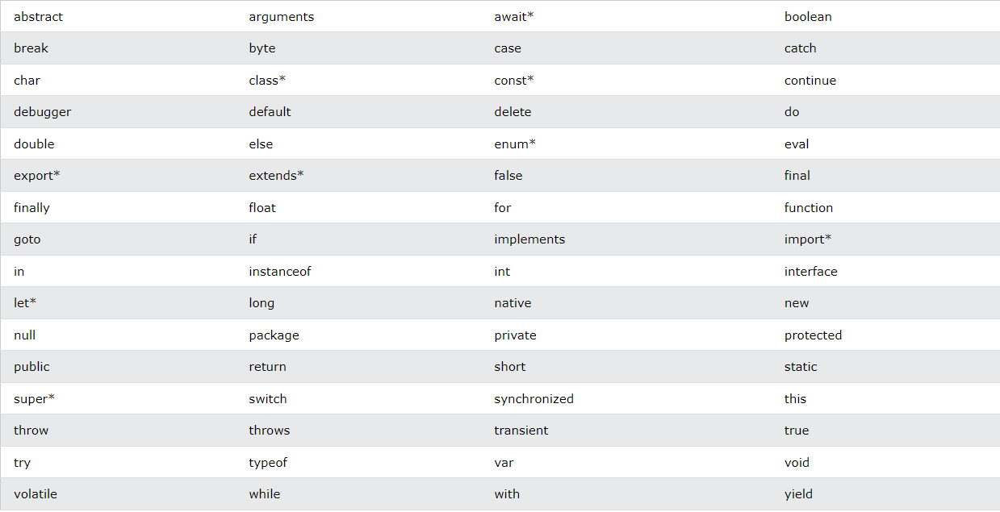
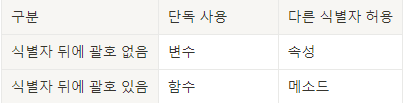

# 용어
  

## 표현식과 문장
* 표현식: 값을 만들어 내는 간단한 코드  
  
        654  
        8 + 24 + 3 * 2
        'GoldApple'
* 문장(statement): 하나 이상의 표혁식이 모인 것. 문장 끝에 세미콜론(;)을 붙이거나 줄바꿈으로 문장 구분 가능
  
        10 + 20 + 30 * 2; var item = 'Gold' + 'Apple';alert('so Expensive...');
          
        10 + 20 + 30 * 2
        var item = 'Gold' + 'Apple'
        alert('so Expensive...')
    '문장'은 영어로 'sentence'이지만 프로그래밍에서의 '문장'은 'statement'의 의미로 쓰입니다. statement의 사전적 의미는 성명, 진술, 서술, 선언 등으로 프로그램에서 문장은 코드를 코드로서 실행(성명, 진술, 서술, 선언 등)할 수 있는 최소 단위라는 의미입니다. ㅇㅇ문이라 되어 있는 구분들 모두 문장을 나타내는 표현입니다.

* 프로그램: 문장이 모인 것

## 키워드
특별한 의미가 있는 단어. 대략적 키워드 목록은 아래와 같습니다.

> 이미지 출처: https://www.w3schools.com/js/js_reserved.asp 
## 식별자
프로그래밍 언어에서 이름을 붙일 때 사용하는 단어. 주로 변수명이나 함수명 등으로 사용됩니다.
* 식별자 생성 규칙  
    키워드 사용 안됨  
    숫자로 시작하면 안됨  
    특수문자는 _와 $만 허용  
    공백 문자를 포함할 수 없습니다.
위의 규칙만 지킨다면 한 글자, 한 글자 특수 문자도 식별자로 사용할 수 있습니다.
### 식별자를 만드는 일반적인 관례  
영어를 사용하며 의미 있는 단어를 사용하여 식별자를 만드는 것이 좋습니다. 아래는 추가적인 관례입니다.
* 클래스: 이름을 항상 대문자로 시작
* 변수, 인스턴스, 함수, 메소드: 항상 소문자로 시작
* 여러 단어로 이루어진 식별자는 각 단어의 첫 글자를 대문자
      
        will out -> willOut  
        well return -> willReturn  
        i am a boy -> iAmABoy
### 식별자의 종류  
* 구분 기준  
      
    대략적으로 네 종류로 나누어 볼 수도 있음
* 예시  
    **alert**('Apple')              -> 함수  
    Array.**length**                -> 속성  
    **input**                       -> 변수  
    **prompt**('Message', 'Defstr') -> 함수  
    Math.**PI**                     -> 속성
    Math.**abs**                    -> 메소드

## 주석 
프로그램 코드를 설명할 때 사용하며 프로그램 실행에 전혀 영향을 주시 않습니다.  

        // 주석
        /* 여러줄 주석 */

## 출력
* 간단한 표현식 확인(구글 개발자 도구)  
    
        > 10 [Enter]
        10
        > 10 + 10 [Enter]
        20
        > 10 * 10 [Enter]
        100
* 경고창에 출력하기  

        
    이때 함수의 괄호 안에 들어가는 것을 매개변수(parameter)라고 부릅니다. 